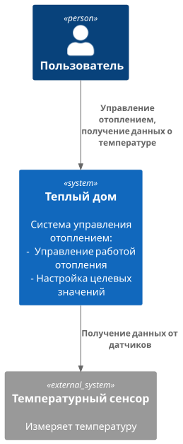
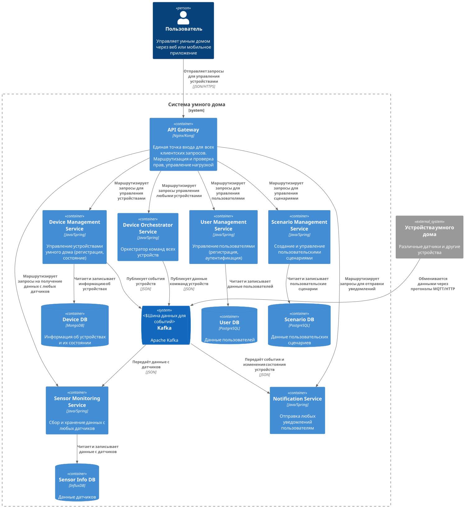
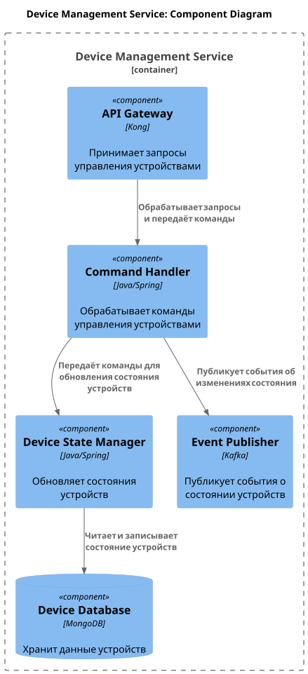
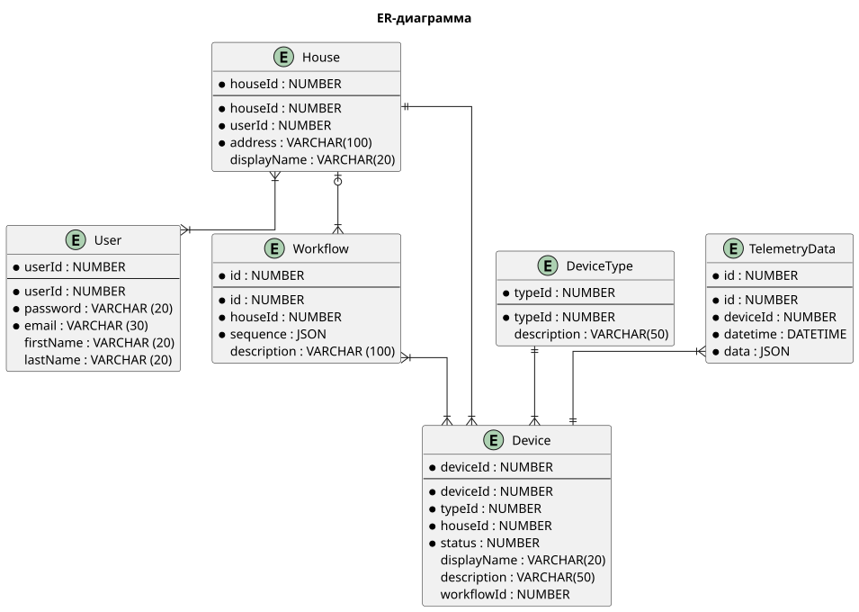

# Project_template

# Задание 1. Анализ и планирование

<aside>
💡

Чтобы составить документ с описанием текущей архитектуры приложения, можно часть информации взять из описания компани и условия задания. Это нормально.

</aside>

### 1. Описание функциональности монолитного приложения

**Управление отоплением:**

- Пользователи могут удалённо включать/выключать отопление

**Мониторинг температуры:**

- Пользователи могут проверять температуру

### 2. Анализ архитектуры монолитного приложения

- Язык программирования: Java
- База данных: PostgreSQL
- Архитектура: Монолитная
- Взаимодействие: Синхронное, запросы обрабатываются последовательно.
- Масштабируемость: Ограничена, так как монолит сложно масштабировать по частям
- Развёртывание: Требует остановки всего приложения.

### 3. Определение доменов и границы контекстов

- Управление отоплением
- Управление состоянием отопления
- Телеметрия температуры
- Хранение температурных показателей от сенсоров
- Пользовательские настройки Хранение настроек системы для пользователя

### **4. Проблемы монолитного решения**

- Проблемы с масштабированием и расширением функционала
- Проблемы с реализацией новых бизнес-целей
- Проблемы с развертыванием приложения

### 5. Визуализация контекста системы — диаграмма С4

# Задание 2. Проектирование микросервисной архитектуры

**Диаграмма контейнеров (Containers)**

**Диаграмма компонентов (Components)**

# Задание 3. Разработка ER-диаграммы

#  ❌ Задание 4. Создание и документирование API

### 1. Тип API

Укажите, какой тип API вы будете использовать для взаимодействия микросервисов. Объясните своё решение.

### 2. Документация API

Здесь приложите ссылки на документацию API для микросервисов, которые вы спроектировали в первой части проектной работы. Для документирования используйте Swagger/OpenAPI или AsyncAPI.